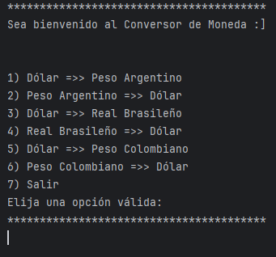
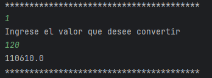

# Convertidor de Monedas

Este es un proyecto simple de convertidor de monedas escrito en Java. Permite convertir entre varias monedas, incluyendo el Dólar, el Peso Argentino, el Real Brasileño y el Peso Colombiano.

## Funcionalidades

El programa presenta las siguientes opciones para la conversión de monedas:

1. Dólar => Peso Argentino
2. Peso Argentino => Dólar
3. Dólar => Real Brasileño
4. Real Brasileño => Dólar
5. Dólar => Peso Colombiano
6. Peso Colombiano => Dólar
7. Salir

## Uso

Al ejecutar el programa, se mostrará un menú con las opciones disponibles. El usuario debe seleccionar una opción válida ingresando el número correspondiente. Luego, se le pedirá que ingrese la cantidad de dinero que desea convertir y el programa mostrará el resultado de la conversión.

## Ejemplo

Al ejecutar el programa, se verá algo similar a lo siguiente:




Después de seleccionar una opción, el programa solicitará la cantidad a convertir y mostrará el resultado.




## Instalación y Ejecución

Para ejecutar este proyecto, asegúrate de tener instalado Java en tu sistema. Luego, sigue estos pasos:

1. Clona o descarga este repositorio.
2. Abre una terminal en el directorio del proyecto.
3. Compila el archivo Java con el siguiente comando:
```bash
javac Convertidor-Monedas.java
```
4. Ejecuta el programa con el siguiente comando:
```bash
javac java Convertidor-Monedas
```